# A Bandit-based Algorithm for Fairness-Aware Hyperparameter Optimization

This repository contains ML artifacts and other materials from the experiments performed on the [paper](https://arxiv.org/abs/2010.03665).

## Key Contributions

- Fairband, a flexible and efficient fairness-aware HO method for multi-objective optimization of the fairness-accuracy trade-off that is agnostic to both the explored hyperparameter space and the objective metrics.
- A dynamic method to automatically search for good fairness-accuracy trade-offs without requiring manual weight parameterization.
- A competitive baseline for fairness-aware HO: random search with balanced fairness-accuracy ranking of hyperparameter configurations.
- Strong empirical evidence that hyperparameter optimization is an effective way to navigate the fairness-accuracy trade-off.
- Competitive results on 4 real world datasets: Fairband achieves significantly improved fairness at a small predictive accuracy cost, and no extra budget when compared to literature HO baselines.


## Repository Structure

- [`data`](data) contains detailed artifacts generated from each experiment;
  - one csv file per dataset, each containing 15 runs per hyperparameter tuner (each uniquely identified by its _run\_uuid_);
  - each iteration (row) details the sampled hyperparameter configuration and validation/test results for predictive accuracy and fairness;
- [`code`](code) contains misc. jupyter notebooks used for the paper;
  - [`code/plots.ipynb`](code/plots.ipynb) generates plots for all datasets from the provided data files;
  - [`code/stats.ipynb`](code/stats.ipynb) computes validation/test results for each experiment, as well as p-values of statistical difference between hyperparameter tuners;
- [`imgs`](imgs) contains all generated plots for all datasets (all plots from the paper plus a few that didn't make it due to space);
- [`hyperparameters`](hyperparameters) contains plots of the distribution from which each hyperparameter was sampled (one plot per model type);


## Fairband: Selected Fairness-Accuracy Trade-off, discriminated by Model Type


Running Fairband (15 runs) on the [Adult dataset](http://archive.ics.uci.edu/ml/datasets/Adult) supplied with the following model choices: Neural Network (NN), Random Forest (RF), Decision Tree (DT), Logistic Regression (LR), LightGBM (LGBM), and Exponentiated Gradient reduction for fair classification (EG).

EG is a state-of-the-art bias reduction method available at [fairlearn](https://github.com/fairlearn/fairlearn).

As shown by the plot, **blindly applying bias reduction techniques may lead to suboptimal fairness-accuracy trade-offs**. In this example, EG can be dominated by NN models. Fairband should be used in conjunction with a wide portfolio of model choices.


<!-- ## Fairband: Fairness and Accuracy Progression

| Adult dataset | AOF dataset |
|:-:|:-:|
|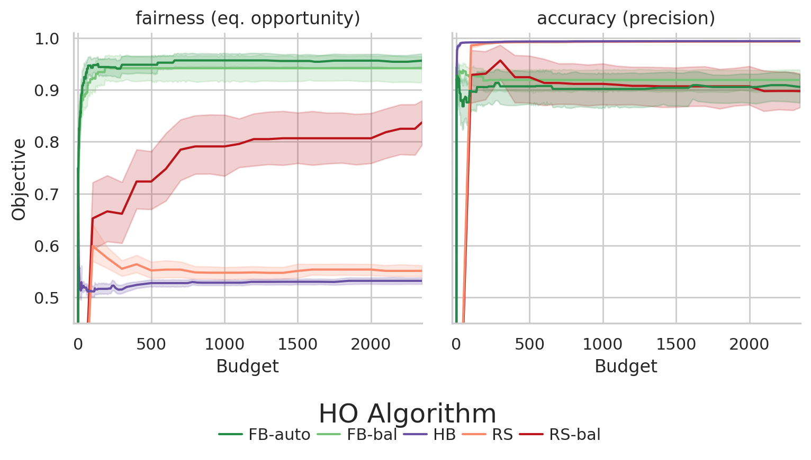|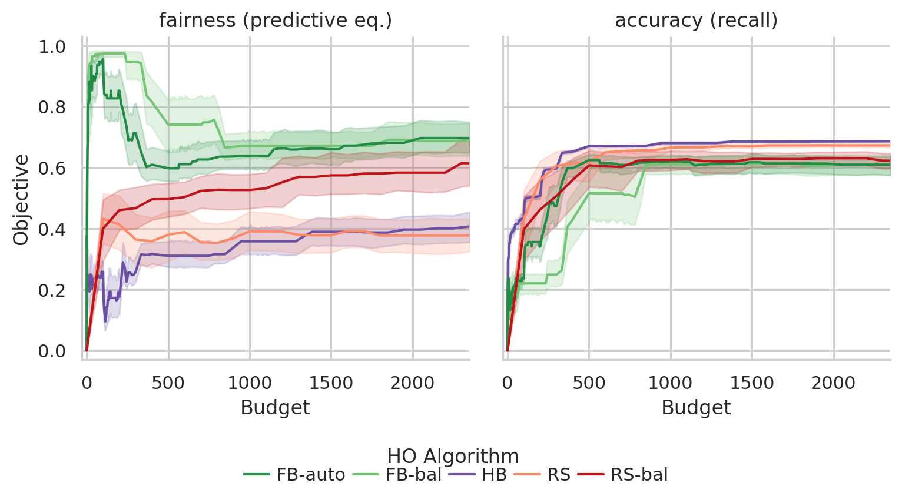|

| COMPAS dataset | Donors Choose dataset |
|:-:|:-:|
|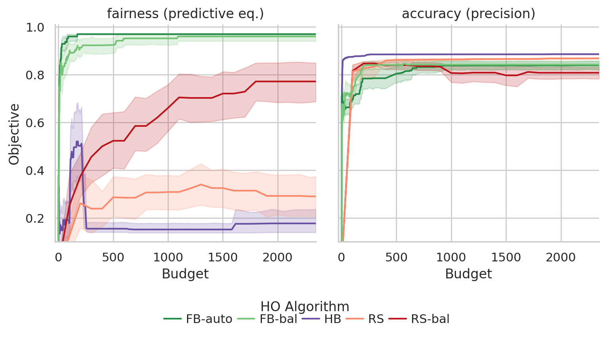|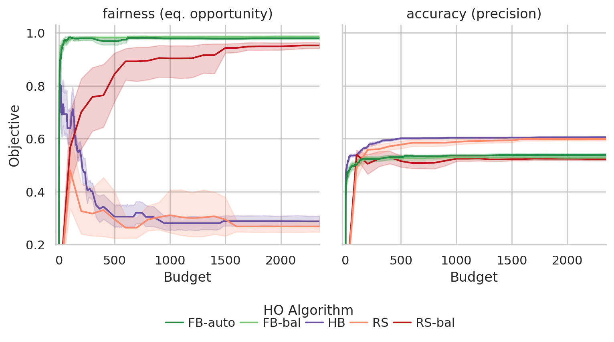|


## Fairband: Model Selection

| Adult dataset | AOF dataset |
|:-:|:-:|
|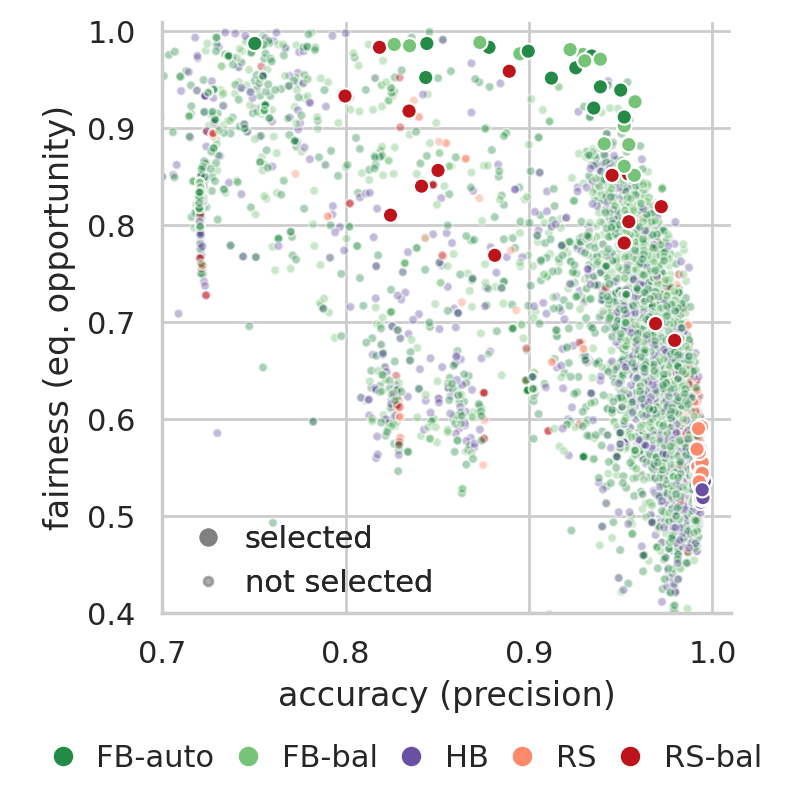|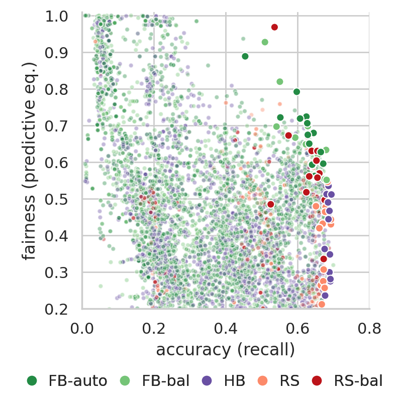|

| COMPAS dataset | Donors Choose dataset |
|:-:|:-:|
|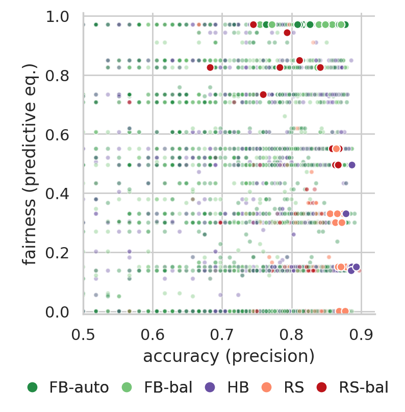||


## Fairband: Density of Pareto Optimal Models, as Iterations Progress

| Adult dataset | AOF dataset |
|:-:|:-:|
|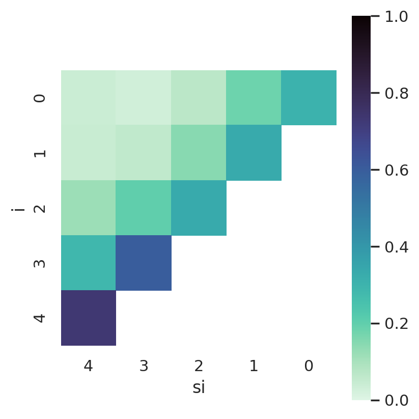|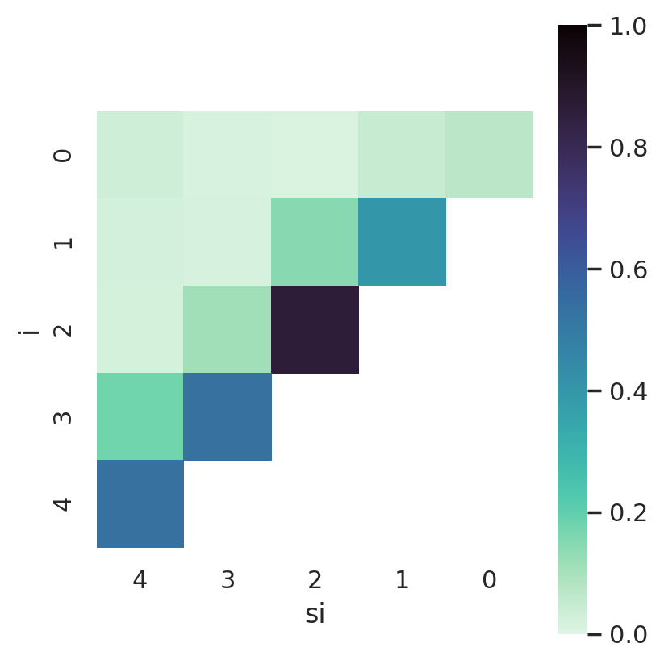|

| COMPAS dataset | Donors Choose dataset |
|:-:|:-:|
|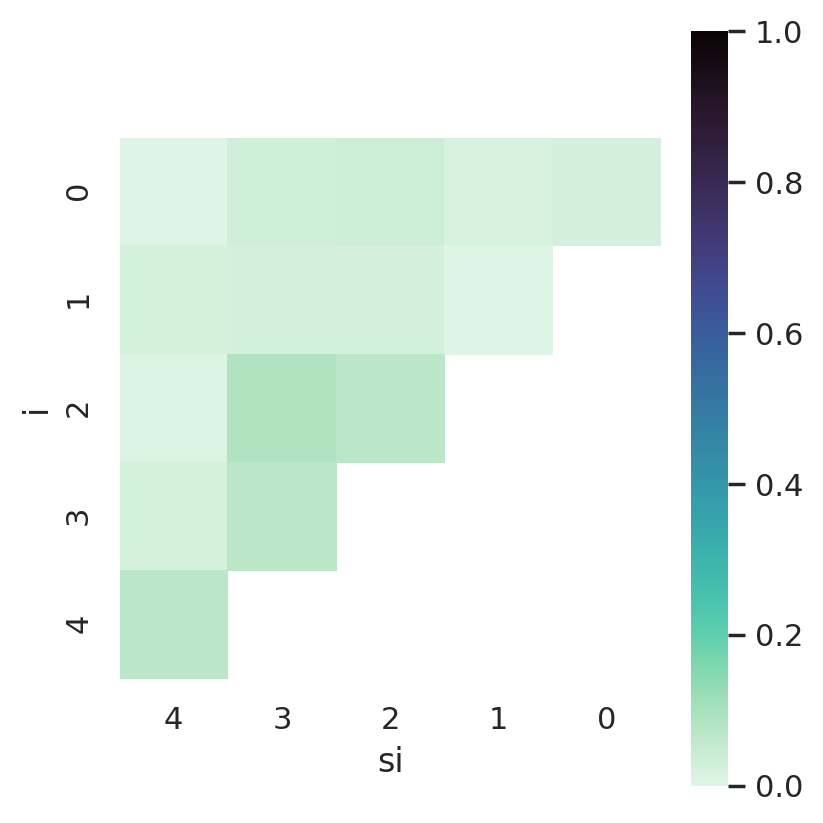|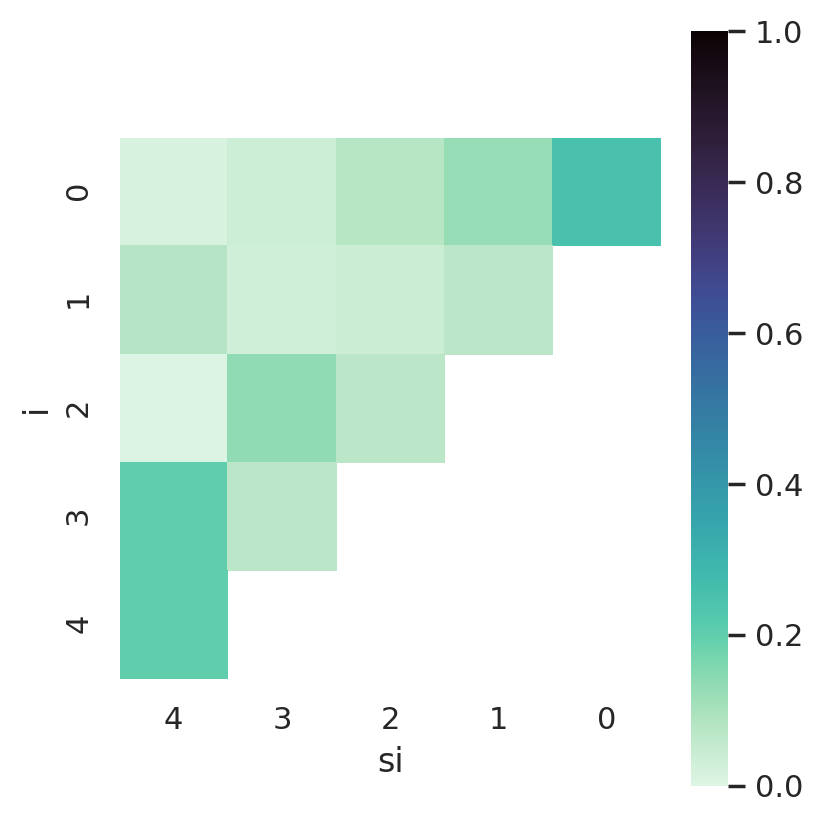| -->


## Citing
```
@misc{cruz2020banditbased,
      title={A Bandit-Based Algorithm for Fairness-Aware Hyperparameter Optimization}, 
      author={F. Cruz, Andr{\'e} and Saleiro, Pedro and Bel{\'e}m, Catarina and Soares, Carlos and Bizarro, Pedro},
      year={2020},
      eprint={2010.03665},
      archivePrefix={arXiv},
      primaryClass={cs.LG}
}
```
