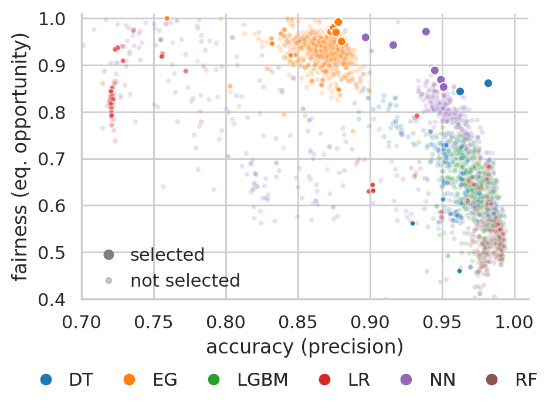

# Promoting Fairness through Hyperparameter Optimization

This repository contains ML artifacts and other materials from the experiments performed on the [paper](https://arxiv.org/pdf/2103.12715.pdf).

## Key Contributions

- An approach for promoting model fairness that can be easily plugged into current ML pipelines with no extra development or computational cost.
- A set of competitive fairness-aware HO algorithms for multi-objective optimization of the fairness-accuracy trade-off that are agnostic to both the explored hyperparameter space and the objective metrics.
- Strong empirical evidence that hyperparameter optimization (HO) is an effective way to navigate the fairness-accuracy trade-off.
- A heuristic to automatically set the fairness-accuracy trade-off parameter.
- Competitive results on a real-world fraud detection use case, as well as on three datasets from the fairness literature (Adult, COMPAS, Donors Choose).


## Repository Structure

- [`data`](data) contains detailed artifacts generated from each experiment;
  - `all_tuner_iters_evals_<dataset>.csv.gz` contains all HO iterations from all tuners for each dataset;
  - `<dataset>_non-aggregated-results.csv` contains one row per each HO run, for all tuners except TPE and FairTPE;
  - `all-datasets-with-TPE-tuner_non-aggregated-results.csv` contains one row per each HO run for TPE and FairTPE (all datasets on the same file);
  - `results_all_datasets.csv` contains one row per each HO run for all tuners, for all datasets;
  - `AOF-EG-experiment_non-aggregated-results.csv` contains data from the EG experiment (adding the Exponentiated Gradient reduction bias-reduction method to the search space);
- [`code`](code) contains misc. jupyter notebooks used for the paper;
  - [`code/plots.ipynb`](code/plots.ipynb) generates plots for all datasets from the provided data files;
  - [`code/stats.ipynb`](code/stats.ipynb) computes validation/test results for each experiment, as well as p-values of statistical difference between hyperparameter tuners;
- [`imgs`](imgs) contains all generated plots for all datasets (all plots from the paper plus a few that didn't make it due to space);
- [`hyperparameters`](hyperparameters) contains details on the hyperparameter search space used for all HO tasks;


## Fairband: Selected Fairness-Accuracy Trade-off, discriminated by Model Type



Running Fairband (15 runs) on the [Adult dataset](http://archive.ics.uci.edu/ml/datasets/Adult) supplied with the following model choices: Neural Network (NN), Random Forest (RF), Decision Tree (DT), Logistic Regression (LR), LightGBM (LGBM), and Exponentiated Gradient reduction for fair classification (EG).

EG is a state-of-the-art bias reduction method available at [fairlearn](https://github.com/fairlearn/fairlearn).

As shown by the plot, **blindly applying bias reduction techniques may lead to suboptimal fairness-accuracy trade-offs**. In this example, EG can be dominated by NN models. Fairband should be used in conjunction with a wide portfolio of model choices.


## Citing
```
@inproceedings{cruz2021FairHO,
      title={{Promoting Fairness through Hyperparameter Optimization}}, 
      author={Andr\'e F. Cruz and Pedro Saleiro and Catarina Bel\'em and Carlos Soares and Pedro Bizarro},
      year={2021},
      eprint={2103.12715},
      archivePrefix={arXiv},
      primaryClass={cs.LG},
      booktitle={ICLR 2021 Workshop on Responsible AI}
}
```
